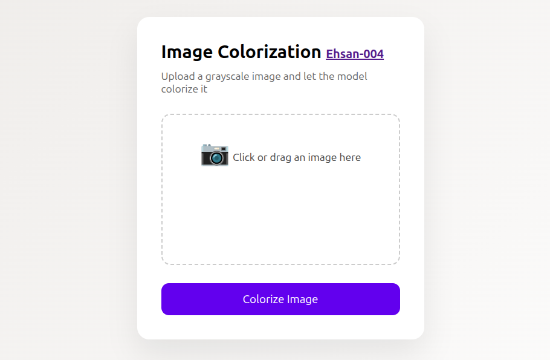
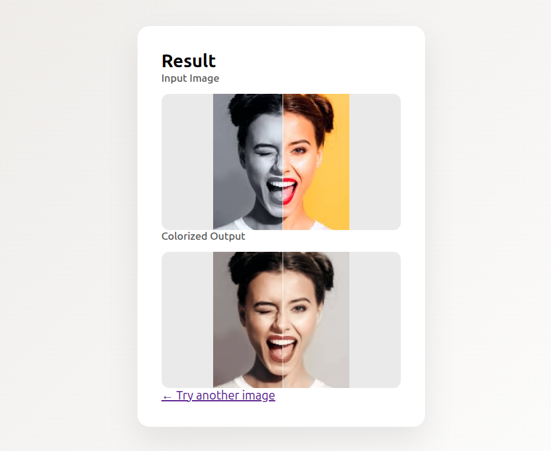

# Colorfule faces!

[](https://github.com/Ehsan-004/FaceRecognition)
[](https://github.com/Ehsan-004/TinyUrler/blob/main/LICENSE)
[](https://github.com/Ehsan-004)
</br>

## A model to colorize face images based on Auto Encoder archutecture
</br>

<table align="center">
  <thead>
    <tr>
      <th style="text-align:center;">Before</th>
      <th style="text-align:center;">After</th>
    </tr>
  </thead>
  <tbody>
    <tr>
      <td align="center">
        
      </td>
      <td align="center">
        
      </td>
    </tr>
    <tr>
      <td align="center">
        
      </td>
      <td align="center">
        
      </td>
    </tr>
    <tr>
      <td align="center">
        
      </td>
      <td align="center">
        
      </td>
    </tr>
    <tr>
      <td align="center">
        
      </td>
      <td align="center">
        
      </td>
    </tr>
    <tr>
      <td align="center">
        
      </td>
      <td align="center">
        
      </td>
    </tr>
    <tr>
      <td align="center">
        
      </td>
      <td align="center">
        
      </td>
    </tr>
    <tr>
      <td align="center">
        
      </td>
      <td align="center">
        
      </td>
    </tr>
  </tbody>
</table>


<br>

## To use:
1. Run fast api back-end: ```fastapi dev App/main.py```
2. Navigate to ```localhost:8000```

<div style="text-align: center;">



</div>


<div style="text-align: center;">



</div>


<br>

## 🧑‍💻 Developer

- [Ehsan-004](https://github.com/Ehsan-004)

## 📜 License

This project is open-source and does not have a specific license. Feel free to use, modify, and distribute it as you see fit.
